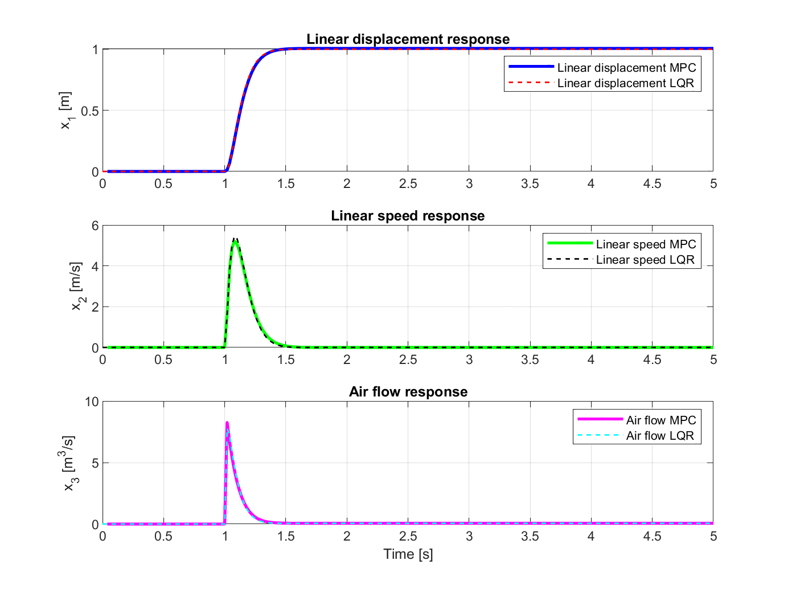

# Model-Predictive-Control

This project implements a custom Model Predictive Control (MPC) algorithm in MATLAB, developed as part of the *Control of Mechatronic Systems* course. The work was proposed independently and conducted under the mentorship of Prof. Ervin Kamenar. 
The project’s objective was to design an MPC controller for a **pneumatic artificial muscle (PAM)** intended for use in a robotic exoskeleton for post-stroke rehabilitation. The implementation is designed to be a flexible starting point for future students and researchers working in advanced control of soft actuators.

Key features:
- Model Predictive Control theory - parameters and principles
- Custom implementation of MPC in MATLAB (no toolbox, no Simulink)
- Full modeling of system dynamics for:
  - A separately excited DC motor (reference system)
  - A pneumatic artificial muscle actuator
- Input and state constraint handling (hard constraints only, due to scope limits)
- Comparison with LQR controller for validation
- Reference tracking and constraint adherence in simulation

Tools used:
- MATLAB (without Simulink)
- `quadprog` for solving constrained quadratic programs

Notes:
- All testing was performed in simulation only
- The control algorithm was **not implemented on hardware**, but the simulation successfully demonstrated reference tracking and constraint handling
- Some corrections and modifications were done on-the-fly, and are extensively described in the last section of the project report
- The state-space model for PAM is approximated by a simple mass-spring-damper system with arbitrary parameters, but dynamics should be correct

[> 📎 Full project report (in English) is available in the provided PDF file.](MPC_Leonard_Miksa.pdf)

[> 📎 First project presentation (in English) focusing on theory is available in the provided PDF file.](MPC_Leonard_Miksa_1.pdf)

[> 📎 Second project presentation (in English) focusing on MATLAB implementation is available in the provided PDF file.](MPC_Leonard_Miksa_2.pdf)

[> 📎 Third project presentation (in English) focusing on corrections and modifications is available in the provided PDF file.](MPC_Leonard_Miksa_3.pdf)

Author:
Leonard Mikša,
MSc Electrical Engineering student,
Email: [leonardmiksa@gmail.com](mailto:leonardmiksa@gmail.com)

---

## Simulation Results

The figure below compares the responses of the system under both MPC and LQR control strategies. The MPC demonstrates comparable reference tracking performance with the added benefit of constraint enforcement and flexibility for future nonlinear extension.

